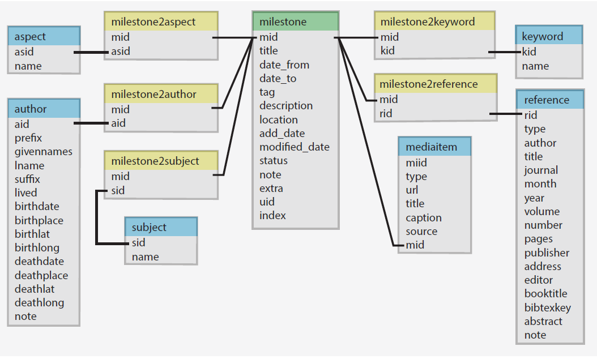

<!-- README.md is generated from README.Rmd. Please edit that file -->

```{r, include = FALSE}
knitr::opts_chunk$set(
  collapse = TRUE,
  comment = "#>",
  fig.path = "man/figures/README-",
  out.width = "100%"
)
```

<!-- badges: start -->
[](https://www.tidyverse.org/lifecycle/#experimental)
[](https://github.com/friendly/heplots/)
<!-- badges: end -->

# milestoneR 


The goal of the `milestoneR` package is to provide R access to the database tables used in the Milestones Project,
  reflecting the history of data visualization, as used in http://datavis.ca/milestones and other applications
  on this site, such as the [Milestones Calendar](http://www.datavis.ca/milestones-cal/).
  This project is described in Friendly et al. (2015).

  Another goal is to document what we have done to create a database comprised of important events in this
  history, combined with source images, external links, references, etc. to make this useful for further
  research.

## Installation

This package is not yet on CRAN. You can install this development version with:

``` r
remotes::install_github("friendly/milestoneR")
```

<!--
You can install the released version of milestoneR from [CRAN](https://CRAN.R-project.org) with:

``` r
install.packages("milestoneR")
```
-->

## Database schema

The milestones database was designed as a relational database (implemented in MySQL).
It consists of the tables shown in the figure below.

The main table
(`milestone`) contains information regarding each of the items considered a milestone in the history
of data visualization. These are linked
to other tables (e.g., `author`, `reference`, `mediaitem`) by unique (primary) keys: `mid` is the
key for a given milestones item.

Each milestones item is coarsely classified in two tables:

* `subject` indicates the substantive context of the milestones event, with categories "Physical",
"Mathematical", "Human", "Other".

* `aspect` indicates the role this event played in the history of data visualization, with categories
"Cartography", "Statistics & Graphics", "Technology", "Other".

In addition, there is a freeform `keyword` table listing keywords or terms attached to milestones items.

Other supporting tables (e.g., `milestones2subject`, `milestone2aspect`) provide for convenient lookups of descriptors of these
milestones items (subject, aspect, keyword) using the milestones id (`mid`) as the key.



## Package Functions

The `milestoneR` package provides three main categories of functions:

### Data Accessor Functions

These functions retrieve the main tables from the package:

* `milestone()` - Get the main milestone table (297 milestones)
* `authors()` - Get the author table (268 authors)
* `reference()` - Get the reference table (352 references)
* `mediaitem()` - Get the media items table
* `keyword()` - Get the keyword lookup table (335 keywords)
* `subject()` - Get the subject lookup table (4 subjects)
* `aspect()` - Get the aspect lookup table (4 aspects)

Linking tables that connect milestones to other entities:

* `milestone2author()` - Links milestones to authors
* `milestone2reference()` - Links milestones to references
* `milestone2keyword()` - Links milestones to keywords (includes keyword names)
* `milestone2subject()` - Links milestones to subjects (includes subject names)
* `milestone2aspect()` - Links milestones to aspects (includes aspect names)

### Helper Functions for Milestones

These functions retrieve related information for one or more milestones:

* `get_milestone_authors(mid)` - Get authors associated with milestone(s)
* `get_milestone_references(mid)` - Get references for milestone(s)
* `get_milestone_keywords(mid)` - Get keywords for milestone(s)
* `get_milestone_subjects(mid)` - Get subjects for milestone(s)
* `get_milestone_aspects(mid)` - Get aspects for milestone(s)
* `get_milestone_media(mid)` - Get media items for milestone(s)

These functions accept single or multiple milestone IDs and return joined data frames.

### Print Functions

Functions for formatted display of database entries:

* `print_milestone(mid, result = c("text", "html", "md"))` - Print complete milestone information
  - Includes authors, description, keywords, subjects, aspects, references
  - Multiple output formats: text, HTML, or markdown
  - Optional `include` parameter to select which sections to display

* `print_reference(rid, result = c("text", "html", "md", "bibtex"))` - Print formatted references
  - Standard citation formats plus BibTeX output
  - Accepts single or multiple reference IDs

* `print_author(aid, result = c("text", "html", "md"))` - Print author information
  - Includes birth/death dates and locations
  - Multiple output formats

### Search Functions

Functions for searching and filtering milestones:

* `search_milestones(pattern, fields, output, ignore.case, ...)` - Full-text search across milestone fields
  - Regular expression support for flexible pattern matching
  - Search in description, tag, note, location, and other fields
  - Three output formats: "mid" (IDs), "print" (formatted), "data" (data frame)

* `search_keywords(pattern, ignore.case, output, ...)` - Search by milestone keywords
  - Find milestones tagged with specific keywords
  - Same output options as search_milestones()

* `search_authors(pattern, name_fields, ignore.case, output, ...)` - Search by author name
  - Find milestones associated with specific authors
  - Search across given names, last names, or both

## Example

```{r example}
library(milestoneR)

# Get all milestones
ms <- milestoneR::milestone()
cat("Total milestones:", nrow(ms), "\n")

# Look at Halley's 1701 contour map milestone
halley <- ms[ms$date_from_numeric == 1701, ]
cat("\nMilestone:", halley$tag, "\n")
cat("Date:", halley$date_from, "\n")

# Get related information using helper functions
authors <- milestoneR::get_milestone_authors(halley$mid)
cat("\nAuthor:", authors$givennames, authors$lname, "\n")

keywords <- milestoneR::get_milestone_keywords(halley$mid)
cat("Keywords:", paste(keywords$keyword, collapse = ", "), "\n")

# Print the complete milestone in text format
cat("\n--- Complete Milestone (text format) ---\n")
milestoneR::print_milestone(halley$mid)
```

### Working with References

```{r references}
# Get references for a milestone
refs <- milestoneR::get_milestone_references(53)
cat("References for milestone 53:\n")
print(refs[, c("rid", "bibtexkey", "author", "year")])

# Print formatted reference
cat("\nFormatted reference (text):\n")
milestoneR::print_reference(refs$rid[1])

# Print as BibTeX
cat("\nAs BibTeX:\n")
milestoneR::print_reference(refs$rid[1], bibtex = TRUE)
```

### Searching Milestones

The package provides flexible search functions for finding milestones by text, keywords, or authors.
The search term can be a regular expression (via `grepl()`).

```{r searching}
# Full-text search for "statistical" in descriptions, tags, and notes
stat_ids <- search_milestones("statistical")
cat("Found", length(stat_ids), "milestones mentioning 'statistical'\n")
cat("First 5:", paste(head(stat_ids, 5), collapse = ", "), "\n")

# Use regex to find "chart" OR "graph"
chart_ids <- search_milestones("chart|graph", fields = c("description", "tag"))
cat("\nFound", length(chart_ids), "milestones with 'chart' or 'graph'\n")

# Search by keyword
contour_ids <- search_keywords("contour")
cat("\nMilestones tagged with 'contour':", paste(contour_ids, collapse = ", "), "\n")

# Search by author name
playfair_ids <- search_authors("Playfair")
cat("\nWilliam Playfair's milestones:", paste(playfair_ids, collapse = ", "), "\n")

# Get formatted output for one result
cat("\nFormatted milestone:\n")
search_milestones("Florence Nightingale", fields = "description", output = "print")
```

### Filtering by Date

```{r filtering}
# Find milestones from a specific time period
ms_1800s <- ms[ms$date_from_numeric >= 1800 & ms$date_from_numeric < 1900, ]
cat("Number of milestones from 1800-1899:", nrow(ms_1800s), "\n")
cat("First few:\n")
print(ms_1800s[1:3, c("mid", "date_from", "tag")])
```

## References

Friendly, M., Sigal, M. & Harnanansingh, D. (2015).
"The Milestones Project: A Database for the History of Data Visualization."
In Kimball, M. & Kostelnick, C. (Eds.)
_Visible Numbers: The History of Data Visualization_, Chapter 10.
London, UK: Ashgate Press.
[preprint](http://datavis.ca/papers/MilestonesProject.pdf)
